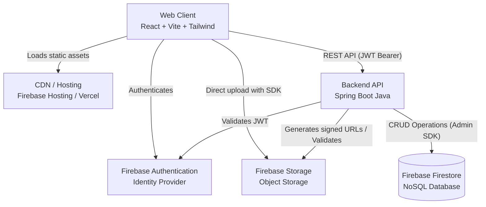
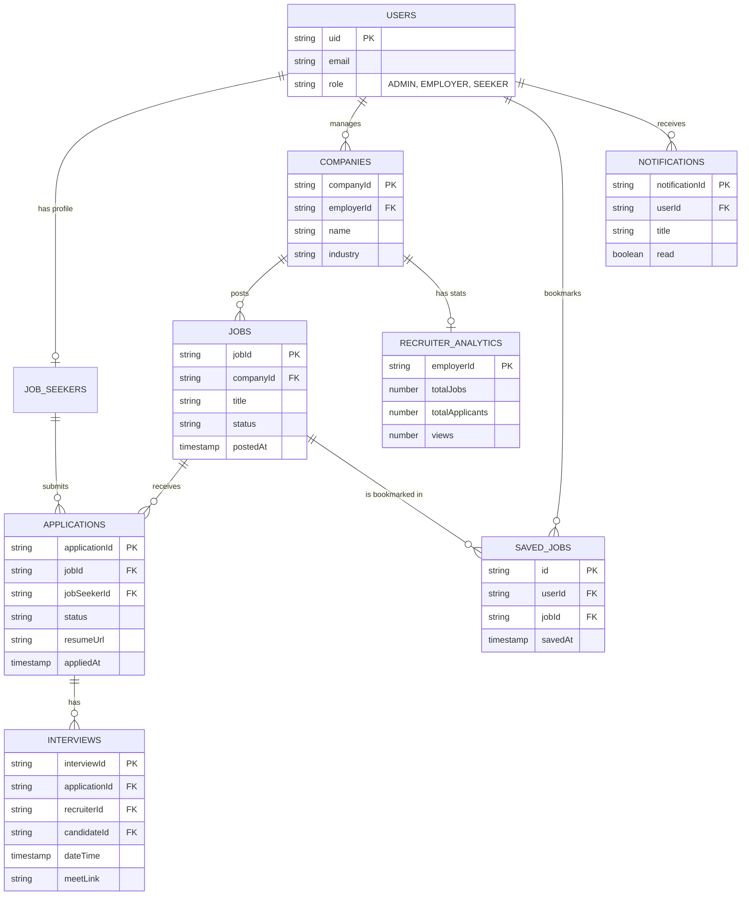

# Job Portal System Architecture Design

## 1. Complete System Architecture

The proposed system follows a decoupled, cloud-native architecture. The frontend is a modern Single Page Application (SPA) that communicates with a stateless Spring Boot backend. Firebase handles Identity, Database, and Object Storage, providing high scalability and real-time capabilities.



### Core Components
- **Frontend Layer**: Built with React and Vite for blazing-fast development and optimized production builds. Tailwind CSS provides utility-first styling for a highly responsive and maintainable UI.
- **Backend Layer**: Spring Boot exposes RESTful APIs. It acts as the orchestration and business logic layer.
- **Data & Storage Layer**: Firestore provides flexible, scalable NoSQL document storage. Firebase Storage handles binary assets (resumes, logos).
- **Authentication Layer**: Firebase Auth handles user signup, login, and password resets, issuing JWTs (ID Tokens) that the backend validates.

---

## 2. Production-Ready Scalable Architecture

To ensure the system is ready for production and can scale to millions of users:

1. **Stateless Backend Services**: The Spring Boot application is completely stateless. Session data is not stored in memory; authentication is strictly JWT-based. This allows infinite horizontal scaling.
2. **Containerization & Orchestration**: The backend is containerized using Docker and deployed to a managed serverless platform like Google Cloud Run or AWS Fargate. This enables auto-scaling from zero to thousands of instances based on traffic.
3. **Direct-to-Cloud Storage**: To prevent the backend from bottlenecking on large file uploads (resumes), the frontend requests a secure, time-limited signed URL or uses Firebase SDK directly with strict Firebase Security Rules to upload files to Firebase Storage. The backend only stores the file metadata/URL.
4. **Caching Strategy**: Implement a CDN for the frontend assets. For the backend, frequently accessed, rarely changing data (like job categories, locations) should be cached in-memory (e.g., Redis or Spring Cache).
5. **CI/CD Pipeline**: GitHub Actions or GitLab CI/CD automatically runs tests, builds the Vite app, builds the Spring Boot Docker image, and deploys to staging/production environments.

---

## 3. Folder Structure

### Frontend (React + Vite)
We use a feature-based architecture for better maintainability as the app grows.

```text
frontend/
├── public/                 # Static assets (favicon, etc.)
├── src/
│   ├── assets/             # Images, global styles
│   ├── components/         # Global shared UI components (Button, Input, Modal)
│   ├── config/             # Firebase configuration & initialization
│   ├── features/           # Feature modules (Domain-driven)
│   │   ├── auth/           # Login, Signup, AuthContext
│   │   ├── jobs/           # JobList, JobDetails, JobFilters
│   │   ├── applications/   # Application tracking, Apply modal
│   │   └── profile/        # User and Company profiles
│   ├── hooks/              # Global custom hooks (useWindowSize, etc.)
│   ├── layouts/            # MainLayout, DashboardLayout
│   ├── pages/              # Route entry points mapping to features
│   ├── routes/             # React Router setup and guards
│   ├── services/           # Axios interceptors, API clients
│   ├── store/              # Global state management (Zustand/Redux)
│   ├── types/              # Global TypeScript interfaces
│   └── utils/              # Helper functions, formatters
├── index.html
├── tailwind.config.js
└── vite.config.js
```

### Backend (Spring Boot)
Follows layered architecture with clear separation of concerns.

```text
backend/
├── src/main/java/com/jobportal/
│   ├── config/             # Firebase config, SecurityConfig, CORS
│   ├── controller/         # REST Controllers (Endpoints)
│   ├── dto/                # Request/Response Data Transfer Objects
│   │   ├── request/
│   │   └── response/
│   ├── exception/          # GlobalExceptionHandler, CustomExceptions
│   ├── filter/             # FirebaseTokenFilter (JWT Interceptor)
│   ├── model/              # Domain entities
│   ├── repository/         # Firestore database interaction layer
│   ├── service/            # Business logic and orchestration
│   │   └── impl/           # Service implementations
│   └── util/               # Constants, Role enums, Helper methods
├── src/main/resources/
│   ├── application.yml     # App properties, environment variables
│   └── firebase-key.json   # Service account key (Injected via secrets)
└── pom.xml / build.gradle
```

---

## 4. Firestore Collections Design

Firestore is NoSQL, so data is optimized for reads and often denormalized.

1. **`users` Collection**
   - Stores all user profiles (Job Seekers, Employers, Admins).
   - *Key fields*: `uid` (from Firebase Auth), `email`, `role`, `firstName`, `lastName`, `createdAt`, `updatedAt`.

2. **`job_seekers` Collection** (Optional extension of `users`)
   - *Key fields*: `userId`, `resumeUrl`, `skills` (Array), `experience`, `education`.

3. **`companies` Collection**
   - *Key fields*: `companyId`, `employerId` (Ref to users), `name`, `description`, `website`, `logoUrl`, `location`.

4. **`jobs` Collection**
   - *Key fields*: `jobId`, `companyId`, `title`, `description`, `requirements` (Array), `salaryRange`, `jobType` (Full-time, Contract), `location`, `status` (Open, Closed), `postedAt`.
   - *Denormalized fields for quick query*: `companyName`, `companyLogoUrl`.

5. **`applications` Collection**
   - *Key fields*: `applicationId`, `jobId`, `jobSeekerId`, `status` (Pending, Reviewed, Interview, Rejected, Accepted), `resumeUrl` (snapshot at time of apply), `coverLetter`, `appliedAt`.

6. **`saved_jobs` Collection**
   - Users can bookmark jobs.
   - *Key fields*: `id`, `userId`, `jobId`, `savedAt`.

7. **`interviews` Collection**
   - Interview Management.
   - *Key fields*: `interviewId`, `applicationId`, `recruiterId`, `candidateId`, `dateTime`, `mode` (Online, In-Person), `meetLink`, `status` (Scheduled, Completed, Cancelled).

8. **`notifications` Collection**
   - Notification System.
   - *Key fields*: `notificationId`, `userId`, `title`, `message`, `read` (boolean), `createdAt`.

9. **`recruiter_analytics` Collection**
   - Recruiter Analytics overview.
   - *Key fields*: `employerId` (PK), `totalJobs`, `totalApplicants`, `views`, `shortlisted`, `hired`.

10. **`job_views` Collection**
    - Tracks job view events for analytics.
    - *Key fields*: `viewId`, `jobId`, `userId` (optional), `viewedAt`.

11. **`activity_logs` Collection**
    - Audit trail and user activity.
    - *Key fields*: `logId`, `userId`, `action` (e.g., "APPLIED", "UPDATED_PROFILE"), `timestamp`.

12. **`skills_master` Collection**
    - Master list of skills for auto-completion and standardisation.
    - *Key fields*: `skillId`, `name`, `category`.

---

## 5. ER Diagram Equivalent (Data Model)

Even though Firestore is NoSQL, representing relationships helps define access patterns and denormalization needs.



---

## 6. Security Architecture & RBAC

### Authentication Flow
1. User logs in on the React frontend using Firebase Auth (Email/Password or OAuth like Google/GitHub).
2. Firebase Auth returns a JWT (ID Token) to the frontend.
3. Frontend attaches this token to the `Authorization: Bearer <token>` header for all API requests to Spring Boot.
4. Spring Boot intercepts the request in `FirebaseTokenFilter`. It uses the Firebase Admin SDK to verify the token signature and expiration.
5. If valid, the user's `uid` and claims are extracted and placed into the Spring Security Context.

### Role-Based Access Control (RBAC)
Roles are managed either via **Firebase Custom Claims** or stored in the `users` Firestore collection.

- **JOB_SEEKER**: Can view jobs, update their profile, apply to jobs, and view their application status.
- **EMPLOYER**: Can create company profiles, post jobs, view applications for their jobs, and update application statuses.
- **ADMIN**: Can manage all users, companies, and jobs. Can ban users or remove inappropriate job postings.

Spring Boot enforces this using method-level security:
```java
@PreAuthorize("hasRole('EMPLOYER')")
@PostMapping("/api/v1/jobs")
public ResponseEntity<JobResponse> createJob(@RequestBody JobRequest request) { ... }
```

### Firestore Security Rules
Since the frontend might read directly from Firestore for real-time updates (e.g., chat or notification systems), Firestore rules are implemented to mirror backend RBAC:
```javascript
rules_version = '2';
service cloud.firestore {
  match /databases/{database}/documents {
    match /jobs/{jobId} {
      allow read: if true; // Public can read jobs
      allow write: if request.auth != null && request.auth.token.role == 'EMPLOYER';
    }
  }
}
```

---

## 7. API Structure

The API follows RESTful conventions, using plural nouns and proper HTTP methods (GET, POST, PUT, PATCH, DELETE).

### Users & Auth
- `POST /api/v1/users/register` - Hook for after Firebase Auth signup to create Firestore record
- `GET /api/v1/users/me` - Get current user profile
- `PUT /api/v1/users/me` - Update current user profile

### Companies
- `POST /api/v1/companies` - Create a company profile (Employer only)
- `GET /api/v1/companies/{id}` - Get company details
- `PUT /api/v1/companies/{id}` - Update company details

### Jobs
- `GET /api/v1/jobs` - List jobs (with pagination and filters: `?location=NY&type=FULL_TIME`)
- `GET /api/v1/jobs/{id}` - Get job details
- `POST /api/v1/jobs` - Create a job (Employer only)
- `PUT /api/v1/jobs/{id}` - Update a job
- `DELETE /api/v1/jobs/{id}` - Close/Delete a job

### Applications
- `POST /api/v1/jobs/{jobId}/applications` - Apply to a job (Seeker only)
- `GET /api/v1/applications` - Get applications (Seekers see theirs, Employers see their jobs' apps)
- `PATCH /api/v1/applications/{id}/status` - Update application status (Employer only)

### Saved Jobs
- `POST /api/v1/saved-jobs/{jobId}` - Bookmark a job (Seeker only)
- `DELETE /api/v1/saved-jobs/{jobId}` - Remove bookmark (Seeker only)
- `GET /api/v1/saved-jobs` - Get saved jobs

### Interviews
- `POST /api/v1/applications/{applicationId}/interviews` - Schedule an interview (Employer only)
- `GET /api/v1/interviews` - Get upcoming interviews
- `PUT /api/v1/interviews/{id}` - Update interview details

### Notifications
- `GET /api/v1/notifications` - Get user notifications
- `PATCH /api/v1/notifications/{id}/read` - Mark notification as read
- `PATCH /api/v1/notifications/read-all` - Mark all as read

### Analytics & Metadata
- `GET /api/v1/analytics/recruiter` - Get recruiter dashboard metrics
- `GET /api/v1/skills` - Get list of master skills for autocomplete
